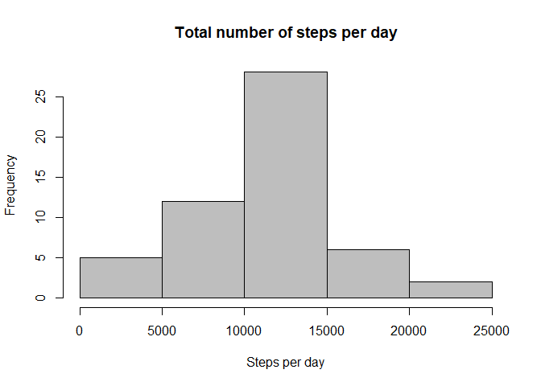
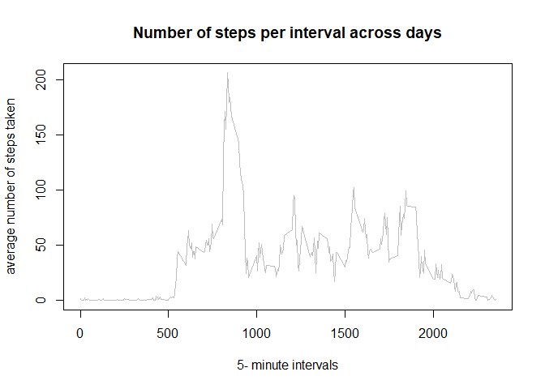
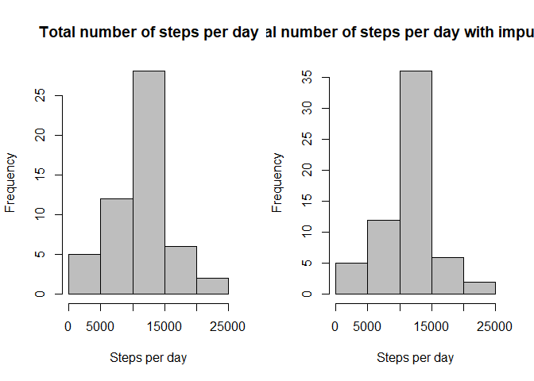
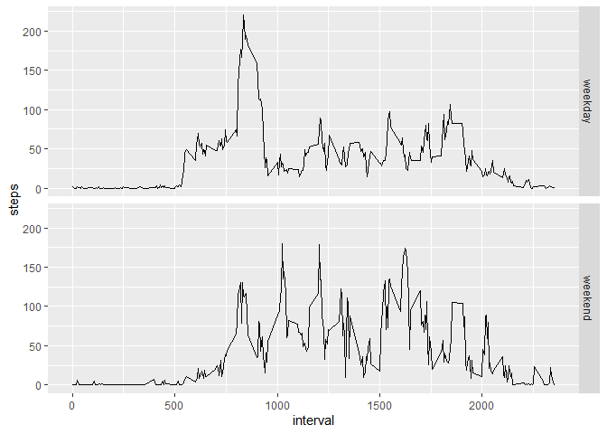

-------------------------------------------------------------------
Title: "PA1_template.Rmd"
author: "Angela Lomba"
date: "22/09/2020"
output: md_document
variant: markdown_github
-------------------------------------------------------------------

This RMarkdown document describes the analysis to return the results of the requirements as defined for the 'Reproducible Research' course Assignment 1. Instructions for the assignment are provided here: https://www.coursera.org/learn/reproducible-research/peer/gYyPt/course-project-1. Data used for the assignment were retrieved from https://d396qusza40orc.cloudfront.net/repdata%2Fdata%2Factivity.zip (downloaded in 22/09/2020 at 17:42 GMT+1).

**Introduction**

This assignment makes use of data from a personal activity monitoring device. This device collects data at 5 minute intervals through out the day. The data consists of two months of data from an anonymous individual collected during the months of October and November, 2012 and include the number of steps taken in 5 minute intervals each day.

*Loading and preprocessing the data*

##Unzipping, reading the data and understanding the data


```r
zipdata<-unzip('C://Users//AngelaLomba//Desktop//ReproducibleResearch//repdata_data_activity.zip') #unzip data
```

```
## Warning in unzip("C://Users//AngelaLomba//Desktop//ReproducibleResearch//
## repdata_data_activity.zip"): error 1 in extracting from zip file
```

```r
data<- read.csv ("activity.csv", header = TRUE, sep = ',') #reading activity data
```

##Looking into the dataset structure and dimensions, and summarize data

Starting by looking into the dataset structure

```r
str(data)
```

```
## 'data.frame':	17568 obs. of  3 variables:
##  $ steps   : int  NA NA NA NA NA NA NA NA NA NA ...
##  $ date    : chr  "2012-10-01" "2012-10-01" "2012-10-01" "2012-10-01" ...
##  $ interval: int  0 5 10 15 20 25 30 35 40 45 ...
```
And summarize the data


```r
summary(data)
```

```
##      steps            date              interval     
##  Min.   :  0.00   Length:17568       Min.   :   0.0  
##  1st Qu.:  0.00   Class :character   1st Qu.: 588.8  
##  Median :  0.00   Mode  :character   Median :1177.5  
##  Mean   : 37.38                      Mean   :1177.5  
##  3rd Qu.: 12.00                      3rd Qu.:1766.2  
##  Max.   :806.00                      Max.   :2355.0  
##  NA's   :2304
```
##Transforming the column containing dates


```r
data$date<-as.Date(data$date)

str(data) #confirming transformation
```

```
## 'data.frame':	17568 obs. of  3 variables:
##  $ steps   : int  NA NA NA NA NA NA NA NA NA NA ...
##  $ date    : Date, format: "2012-10-01" "2012-10-01" ...
##  $ interval: int  0 5 10 15 20 25 30 35 40 45 ...
```

*Q1. What is mean total number of steps taken per day?*
(For this part of the assignment, missing values can be ignored)

1.1. Calculate the total number of steps taken per day

```r
stepspday<- aggregate (steps~date, data = data, FUN=sum, na.rm = TRUE)

stepspday
```

```
##          date steps
## 1  2012-10-02   126
## 2  2012-10-03 11352
## 3  2012-10-04 12116
## 4  2012-10-05 13294
## 5  2012-10-06 15420
## 6  2012-10-07 11015
## 7  2012-10-09 12811
## 8  2012-10-10  9900
## 9  2012-10-11 10304
## 10 2012-10-12 17382
## 11 2012-10-13 12426
## 12 2012-10-14 15098
## 13 2012-10-15 10139
## 14 2012-10-16 15084
## 15 2012-10-17 13452
## 16 2012-10-18 10056
## 17 2012-10-19 11829
## 18 2012-10-20 10395
## 19 2012-10-21  8821
## 20 2012-10-22 13460
## 21 2012-10-23  8918
## 22 2012-10-24  8355
## 23 2012-10-25  2492
## 24 2012-10-26  6778
## 25 2012-10-27 10119
## 26 2012-10-28 11458
## 27 2012-10-29  5018
## 28 2012-10-30  9819
## 29 2012-10-31 15414
## 30 2012-11-02 10600
## 31 2012-11-03 10571
## 32 2012-11-05 10439
## 33 2012-11-06  8334
## 34 2012-11-07 12883
## 35 2012-11-08  3219
## 36 2012-11-11 12608
## 37 2012-11-12 10765
## 38 2012-11-13  7336
## 39 2012-11-15    41
## 40 2012-11-16  5441
## 41 2012-11-17 14339
## 42 2012-11-18 15110
## 43 2012-11-19  8841
## 44 2012-11-20  4472
## 45 2012-11-21 12787
## 46 2012-11-22 20427
## 47 2012-11-23 21194
## 48 2012-11-24 14478
## 49 2012-11-25 11834
## 50 2012-11-26 11162
## 51 2012-11-27 13646
## 52 2012-11-28 10183
## 53 2012-11-29  7047
```

1.2. Make a histogram of the total number of steps taken each day

```r
hist(stepspday$steps, main = 'Total number of steps per day', xlab = 
'Steps per day', col = 'gray')
```

<!-- -->

1.3. Calculate and report the mean and median of the total number of steps taken per day

```r
meanstepspday<-mean(stepspday$steps) #calculation of the mean of  steps per day
meanstepspday #report of the mean steps per day
```

```
## [1] 10766.19
```

```r
medianstepspday<-median(stepspday$steps) #calculation of the median of steps per day
medianstepspday #report of the median steps per day
```

```
## [1] 10765
```

*Q2.What is the average daily activity pattern?*
2.1.Make a time series plot (i.e. type = "l") of the 5-minute interval (x-axis) and the average number of steps taken, averaged across all days (y-axis)


```r
stepsmean<- aggregate (steps~interval, data = data, FUN = mean, na.rm = TRUE) #aggregate values for step mean for each interval

plot(stepsmean$interval, stepsmean$steps, type = 'l', col = 'gray', xlab = '5- minute intervals', ylab = 'average number of steps taken', main = 'Number of steps per interval across days') #plot
```

<!-- -->

2.2.Which 5-minute interval, on average across all the days in the dataset, contains the maximum number of steps?


```r
MaxSteps<-max (stepsmean$steps) #calculating the maximum number of steps per interval

MaxSteps #retrieving the maximum number of steps
```

```
## [1] 206.1698
```

```r
MaxInt<-stepsmean$interval[which (stepsmean$steps == MaxSteps)]

MaxInt #retrieving the interval containing the maximum number of steps
```

```
## [1] 835
```
*Q3. Imputing missing values*

3.1.Calculate and report the total number of missing values in the dataset (i.e. the total number of rows with NAs)


```r
sum(is.na(data))# matches the number of NAs retrieved with the summary function for the steps variable
```

```
## [1] 2304
```

3.2.Devise a strategy for filling in all of the missing values in the dataset.


```r
#calculate the mean steps for each interval
StepspInt<- tapply(data$steps, data$interval, mean, na.rm = TRUE)

#Split the dataset in two datasets, one with NAs and without NAs (NNAS)
dataNAs<- data[is.na(data$steps), ]
dataNNAS<- data[!is.na(data$steps), ]

#Replace missing values in the dataset with NAs
dataNAs$steps <- as.factor(dataNAs$interval)
levels(dataNAs$steps) <- StepspInt

#change the vector to integer
levels(dataNAs$steps) <- round(as.numeric(levels(dataNAs$steps)))
dataNAs$steps<- as.integer(as.vector(dataNAs$steps))

#merge the two datasets together
IMPdata<- rbind(dataNAs, dataNNAS)

str(IMPdata)
```

```
## 'data.frame':	17568 obs. of  3 variables:
##  $ steps   : int  2 0 0 0 0 2 1 1 0 1 ...
##  $ date    : Date, format: "2012-10-01" "2012-10-01" ...
##  $ interval: int  0 5 10 15 20 25 30 35 40 45 ...
```

3.3.Plot


```r
#plotting parameters to have two histograms in the same row
par(mfrow = c (1, 2))

#Add the plot of the first part of the assignment 
stepspday<- aggregate (steps~date, data = data, FUN=sum, na.rm = TRUE)
hist(stepspday$steps, main = 'Total number of steps per day', xlab = 
'Steps per day', col = 'gray')

#Plot the new histogram reflecting the dataset after imputed missing values
IMPStepsDay<-aggregate (steps~date, data = IMPdata, FUN = sum, na.rm = TRUE)
hist(IMPStepsDay$steps, main = 'Total number of steps per day with imputed NAs', xlab = 
'Steps per day', col = 'gray')
```

<!-- -->


*Q3. Are there differences in activity patterns between weekdays and weekends?*
For this part the weekdays() function may be of some help here. Use the dataset with the filled-in missing values for this part.

3.1. Create a new factor variable in the dataset with two levels – “weekday” and “weekend” indicating whether a given date is a weekday or weekend day.


```r
#categorize saturday and sunday as factor level 'weekend', and the rest as 'weekday'
IMPdata$DType <-ifelse(weekdays(as.Date(IMPdata$date)) =="sabado"| weekdays(as.Date(IMPdata$date)) =="domingo", "weekend", "weekday")

#transform Dtype variable to factor
IMPdata$DType<- factor(IMPdata$DType)
```


3.2. Make a panel plot containing a time series plot (i.e. type = "l") of the 5-minute interval (x-axis) and the average number of steps taken, averaged across all weekday days or weekend days (y-axis). See the README file in the GitHub repository to see an example of what this plot should look like using simulated data.


```r
#aggregate data as mean steps for all intervals, across week and weekend days 
SIntDType<- aggregate (steps ~interval + DType, data = IMPdata, FUN = mean)

#check new dataframe
head(SIntDType)
```

```
##   interval   DType     steps
## 1        0 weekday 1.9811321
## 2        5 weekday 0.3396226
## 3       10 weekday 0.1320755
## 4       15 weekday 0.1509434
## 5       20 weekday 0.0754717
## 6       25 weekday 1.3773585
```


```r
library (ggplot2)

#plot aggregated data
ggplot(data = SIntDType, aes (interval, steps))+ facet_grid(DType~.) + geom_line()
```

<!-- -->
